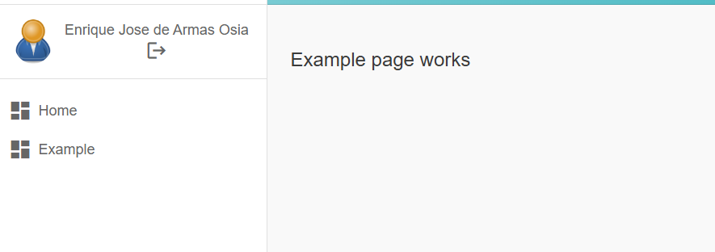

# Eklipse GCM (Frontend)

Este proyecto fue generado con [Angular CLI](https://github.com/angular/angular-cli) version 20.3.0

## Implementación de microfrontend con Module Federation

Puede seguir este [link](https://www.youtube.com/watch?v=PnzI3GGozLA&ab_channel=weincode) para ver el tutorial que se siguió para este proyecto.

Usar `ng add @angular-architects/module-federation --project nameproject --port 9999` para generar archivos `webpack.config.js` y `webpack.prod.config.js` en el proyecto seleccionado.

A pesar de que la tendencia ya no es webpack, en entonos de desarrollo ha probado ser lo mejor, ademas de que algunas funcionalidades no funcionan correctamente al usar compiladores mas modernos,
mientras native-federation evoluciona, se recomienda seguir trabajando con module-federation.

## Ejemplo para ejecutar nuevos mfs sin usar el cli de angular

1) Copia esta linea en el angular.json y reemplaza `example` por el nombre de tu nuevo mf.

```json
"example":{"projectType":"application","root":"projects/example","sourceRoot":"projects/example/src","prefix":"app","architect":{"build":{"builder":"ngx-build-plus:browser","options":{"tsConfig":"projects/example/tsconfig.app.json","inlineStyleLanguage":"scss","assets":[{"glob":"**/*","input":"projects/example/public","output":"."}],"main":"projects/example/src/main.ts","outputPath":"dist/example","index":"projects\\example\\src\\index.html","extraWebpackConfig":"projects/example/webpack.config.js","commonChunk":false},"configurations":{"production":{"budgets":[{"type":"initial","maximumWarning":"500kB","maximumError":"1MB"},{"type":"anyComponentStyle","maximumWarning":"4kB","maximumError":"8kB"}],"fileReplacements":[{"replace":"@env/environment.ts","with":"@env/environment.prod.ts"}],"outputHashing":"all","extraWebpackConfig":"projects/example/webpack.prod.config.js"},"development":{"optimization":false,"extractLicenses":false,"sourceMap":true}},"defaultConfiguration":"production"},"serve":{"builder":"ngx-build-plus:dev-server","configurations":{"production":{"buildTarget":"example:build:production","extraWebpackConfig":"projects/example/webpack.prod.config.js"},"development":{"buildTarget":"example:build:development"}},"defaultConfiguration":"development","options":{"port":4199,"publicHost":"http://localhost:4199","extraWebpackConfig":"projects/example/webpack.config.js"}},"extract-i18n":{"builder":"@angular/build:extract-i18n"},"test":{"builder":"@angular/build:karma","options":{"tsConfig":"projects/example/tsconfig.spec.json","inlineStyleLanguage":"scss","assets":[{"glob":"**/*","input":"projects/example/public"}]}}}},
```

2) Copia y pega la carpeta `private/example` en `projects/*`, y reemplaza example por el nombre de tu mf.

3) Declara el modulo en `mf.d.ts`
```typescript
declare module 'example/*';
```

4) Agrega la ruta a el archivo principal

```typescript
{
    path: 'example',
    //canActivate: [AuthoritiesGuard],
    loadChildren: () => import('example/mf').then((m) => m.routes),
    //data: { authorities: [] },
},
```

5) Descomenta esta linea en `tsconfig.app.json`

```json
//example: generateMfUrl('example', 4199, prod),
```

6) Descomenta esta linea en `webpack.config.json`

```json
//{ "path": "./private/example/tsconfig.app.json" },
//{ "path": "./private/example/tsconfig.spec.json" },
```

7) Agrega la ruta a `admin.snav.usuarios.ts` para verla en el sidebar.

```typescript
{
    type: 'link',
    name: 'Example',
    icon: 'dashboard',
    url: 'example/page-one',
},
```


